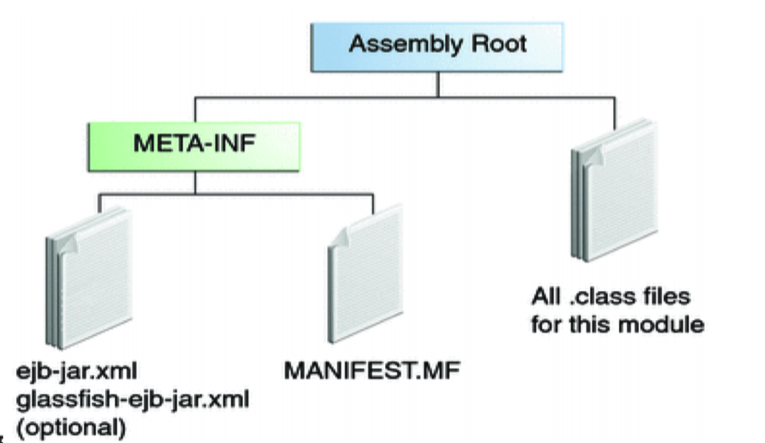

## Session Beans - parte 1

Rodrigo Prestes Machado (rodrigo.prestes at poa.ifrs.edu.br)


## Assuntos

* Tipos de Interfaces
<!-- .element: class="fragment" -->
  
* Desenvolvendo Session Beans
<!-- .element: class="fragment" -->

* Acessando Enterprise Beans
<!-- .element: class="fragment" -->

* Empacotamento
<!-- .element: class="fragment" -->


## Tipos de Interfaces
<!-- .element: data-background-color="#ff0000" -->


## Interface local ou remota?
 
* Quando você projeta uma aplicação Java EE, uma das primeiras decisões é definir o tipo de acesso aos enterprise beans: local, remoto ou por meio de Web Services
<!-- .element: class="fragment" -->

* Permitir o acesso local ou remoto depende dos seguintes fatores:
<!-- .element: class="fragment" -->

  * **Acoplamento entre os beans:** Se o acoplamento entre os beans for forte, ou seja, um bean depende de outro, então estes beans são fortes candidatos para acesso local
  <!-- .element: class="fragment" -->

  * **Tipo dos clientes:** Se um enterprise bean é acessado por várias aplicações, então, é interessante permitir acesso remoto
  <!-- .element: class="fragment" -->


## Interface local ou remota?
  
* **Distribuição dos Componentes:** Aplicações Java EE são escaláveis pois, permitem que os componentes sejam distribuídos em múltiplas máquinas. Assim, neste tipo de cenário é adequado permitir acesso remoto
<!-- .element: class="fragment" -->

* **Performance:** Devido a fatores como a latência da rede, chamadas remotas pode ser mais lentas do que as chamadas locais. Por outro lado, se você distribuir componentes entre servidores diferentes, você pode melhorar o desempenho geral da aplicação
<!-- .element: class="fragment" -->

* Na dúvida, escolha acesso remoto, pois, esta é uma decisão que torna a arquitetura mais flexível
<!-- .element: class="fragment" -->


## Interface local ou remota?

* Os métodos de um session bean são definidos de duas formas:
  <!-- .element: class="fragment" -->
  * **No-interface view:** métodos públicos de um enterprise bean
  <!-- .element: class="fragment" -->
  
  * **Business interface:** padrão da linguagem de programação Java que contém os métodos de negócio de um bean (local ou remoto)
    <!-- .element: class="fragment" -->

* Definir os métodos da interface de um enterprise bean é uma atividade importante, pois, isto isola os clientes das possíveis mudanças no bean
<!-- .element: class="fragment" -->


## Desenvolvendo Session Beans


## Desenvolvendo Session Beans

* Para desenvolver um Session Bean você necessita criar:
  <!-- .element: class="fragment" -->
  * **Enterprise bean class:** implementa as regras de negócio de um bean
  <!-- .element: class="fragment" -->
  
  * **Business interfaces:** define os métodos que serão implementados por um bean
  <!-- .element: class="fragment" -->
  
  * **Helper classes:** são classes necessárias para a implementação do bean (ex.: dependências)
  <!-- .element: class="fragment" -->


## Desenvolvendo Session Beans

* Métodos públicos (*no-interface view*)
<!-- .element: class="fragment" -->

* Interface de negócio:
  <!-- .element: class="fragment" -->
  
  * Interface local
  <!-- .element: class="fragment" -->

  * Interface remota
  <!-- .element: class="fragment" -->  


## Clientes Locais

* Um cliente local tem as seguintes características:
<!-- .element: class="fragment" -->

  * Deve ser executado na mesma aplicação que o enterprise bean
  <!-- .element: class="fragment" -->
  
  * Pode ser um componente Web ou outro enterprise bean
  <!-- .element: class="fragment" -->
  
  * A localização do enterprise bean não é transparente
  <!-- .element: class="fragment" -->


## Métodos Públicos

* A interface pública de um bean é uma visão local
<!-- .element: class="fragment" -->

* Os métodos públicos da classe que implementa um enterprise bean são expostos aos clientes locais que podem acessar o bean
<!-- .element: class="fragment" -->

* Enterprise beans desenvolvidos desta forma não implementam uma interface de negócio
<!-- .element: class="fragment" -->


## Métodos Públicos

* Se a interface do bean não é decorada com @Local ou @Remote, então, por padrão a interface é local
<!-- .element: class="fragment" -->

* Para construir um enterprise bean que permite o acesso apenas local, você pode fazer o seguinte:
<!-- .element: class="fragment" -->

  * Crie uma classe que implementa um bean, mas, não implementa uma interface de negócio. Isto indica que o bean expõe os seus métodos públicos, por exemplo:
  <!-- .element: class="fragment" -->

```java
@Stateless
public class MyEJB { ... }
```
<!-- .element: class="fragment" -->


## Interface Local

* Para utilizar uma interface local devemos primeiro anotar a interface de negócio do bean com @Local. Por exemplo:
<!-- .element: class="fragment" -->

```java
@Local
public interface InterfaceName { ... }
```
<!-- .element: class="fragment" -->

* Depois, devemos especificar uma interface para a classe que implementa o bean por meio da anotação @Local. Por exemplo:
<!-- .element: class="fragment" -->

```java
@Local(InterfaceName.class)
public class BeanName implements InterfaceName { ... }
```
<!-- .element: class="fragment" -->


## Clientes Remotos

* Um cliente remoto de um enterprise bean tem as seguintes características:
<!-- .element: class="fragment" -->

  * Pode ser um componente Web, um aplicativo cliente ou outro enterprise bean
  <!-- .element: class="fragment" -->

  * Pode ser executado em uma máquina diferente e uma JVM diferente do enterprise bean que ele acessa
  <!-- .element: class="fragment" -->

  * A localização do enterprise bean deve ser transparente para o cliente remoto
  <!-- .element: class="fragment" -->

  * O enterprise bean deve implementar uma interface de negócios, ou seja, um cliente remoto não pode acessar um bean apenas através da interface pública (*no-interface view*)
  <!-- .element: class="fragment" -->


## Interface Remota

* Para criar um bean que permite o acesso remoto, você deve:
<!-- .element: class="fragment" -->

  * Decorar a interface de negócios do enterprise bean com a anotação @Remote anotação
  <!-- .element: class="fragment" -->

```java
@Remote
public interface InterfaceName {... }
```
<!-- .element: class="fragment" -->


## Acesso Remoto

* Depois, decore a classe bean com @Remote, especificando as interfaces de negócio:
<!-- .element: class="fragment" -->

```java
 @Remote(InterfaceName.class)
 public class BeanName implements InterfaceName{}
```
<!-- .element: class="fragment" -->

* A interface remota define os métodos de negócio e ciclo de vida que são específicos para o bean
<!-- .element: class="fragment" -->

* Por exemplo, a interface remota de um bean chamado BankAccountBean pode ter métodos de negócios chamados de deposit e credit
<!-- .element: class="fragment" -->


## Acesso Remoto

* Depois, decore a classe do bean com @Remote, especificando as interfaces de negócio:
<!-- .element: class="fragment" -->

```java
@Remote(InterfaceName.class)
public class BeanName implements InterfaceName{}
```
<!-- .element: class="fragment" -->

* A interface remota define os métodos de negócio e ciclo de vida que são específicos para o bean
<!-- .element: class="fragment" -->


## Acessando Enterprise Beans


## Acessando um Enterprise Bean

* Os clientes necessitam obter uma instância de um enterprise bean, assim, esta instância pode ser obtida de duas formas:
<!-- .element: class="fragment" -->

  * **Dependency injection:** por meio de anotações Java
  <!-- .element: class="fragment" -->
  
  * **Java Naming and Directory Interface (JNDI) lookup:** usando a sintaxe do JNDI para encontrar a instância do bean
  <!-- .element: class="fragment" -->


## Acessando um Enterprise Bean

* Injeção de Dependência é a maneira mais fácil para obter uma referência para um enterprise bean
 <!-- .element: class="fragment" -->

* Entretanto, clientes que rodam fora do servidor de aplicação, como por exemplo, aplicações Java SE, necessitam localizar o bean por meio de JNDI
 <!-- .element: class="fragment" -->

* Por exemplo, classes POJO (*Plain Old Java Objects*) devem utilizar JNDI para acessar um session bean
 <!-- .element: class="fragment" -->


## Acessando Beans locais

* O acesso do cliente ao enterprise beans locais é feito através de injeção de dependência ou JNDI
<!-- .element: class="fragment" -->

* Para obter uma referência para a interface local do bean quando por meio da injeção de dependência, use a anotação javax.ejb.EJB
<!-- .element: class="fragment" -->

```java
@EJB(beanName="ServiceBean”)
private Service service;
```
<!-- .element: class="fragment" -->


## Acessando Beans locais

* Para obter uma referência através de JNDI, use os métodos da interface javax.naming.InitialContext:
<!-- .element: class="fragment" -->

```java
Exemplo ExampleLocal = (Exemplo) InitialContext.lookup("java:módulo / ExampleLocal");
```
<!-- .element: class="fragment" -->


## Acessando Beans Remotos

* O acesso do cliente para um bean que implementa uma interface remota é realizado através de injeção de dependência ou JNDI
<!-- .element: class="fragment" -->

* Para obter uma referência para um bean que implementa uma interface de negócios remota por meio de injeção de dependência, use a anotação `javax.ejb.EJB` e especifique o nome da interface remota:
<!-- .element: class="fragment" -->

```java
@EJB(beanName="ServiceBean")
private Service service;
```
<!-- .element: class="fragment" -->


## Acessando Beans Remotos

* Para obter uma referência para a interface remota de um bean através de JNDI, use a interface javax.naming.InitialContext como forma de pesquisa:
<!-- .element: class="fragment" -->

```java
ExampleRemote example = (ExampleRemote)
InitialContext.lookup("java:global/myApp/ExampleRemote");
```
<!-- .element: class="fragment" -->


## Sintaxe JNDI

* Existem três namespaces JNDI para procurar enterprises beans: java:global, java:module, java:app
<!-- .element: class="fragment" -->

* **java:global** - é a maneira de encontrar beans remotos usando consultas JNDI. Endereços JNDI são da seguinte forma:
<!-- .element: class="fragment" -->
  * java:global[/application name]/module name/bean name[/interface name]
  <!-- .element: class="fragment" -->

* **java:module** - é utilizado para encontrar enterprise beans dentro do mesmo módulo. Endereços JNDI que utilizam java:module tem o formato:
<!-- .element: class="fragment" -->

    * java:module/bean name/[interface name]
    <!-- .element: class="fragment" -->

* **java:app** - é utilizado para encontrar enterprise beans dentro da mesma aplicação:
<!-- .element: class="fragment" -->

  * java:app[/module name]/enterprise bean name[/interface name]
  <!-- .element: class="fragment" -->


## Empacotamento


## Empacotando um EJB

* Existem duas formas de fazer um deploy de enterprise beans por meio de arquivos JAR (Java Archive):
<!-- .element: class="fragment" -->

* Você pode empacotar um ou mais JARs dentro de um EAR (Enterprise Archive). Assim, quando você fizer o deploy de um EAR no servidor de aplicação todos os beans também serão implantados
<!-- .element: class="fragment" -->

* Você também pode implantar um JAR EJB que não está contido em um arquivo EAR
<!-- .element: class="fragment" -->


## Empacotando um EJB num Jar

* Estrutura de um JAR Enterprise Bean Empacotando um EJB
<!-- .element: class="fragment" -->

 <!-- .element height="60%" width="60%" -->
<!-- .element: class="fragment" -->


## Empacotando um EJB num WAR

* Enterprises Beans frequentemente fornecem a lógica de negócios de uma aplicação Web
<!-- .element: class="fragment" -->

* Assim, o empacotamento do bean dentro do módulo Web (WAR) simplifica a organização da aplicação
<!-- .element: class="fragment" -->

* Enterprise beans podem ser empacotados dentro de um módulo WAR como um arquivo de classes Java
<!-- .element: class="fragment" -->

* Também pode ser empacotados como arquivos JAR e incluídos dentro do WAR
<!-- .element: class="fragment" -->


## Empacotando um EJB num WAR

* Para incluir uma classe de um enterprise bean em um WAR, basta colocar a classe no diretório WEB-INF/classes
<!-- .element: class="fragment" -->

* Para incluir um arquivo JAR que contém um enterprise bean em um WAR, é necessário colocar o arquivo JAR dentro do diretório WEB-INF/lib
<!-- .element: class="fragment" -->

* **Nota:** Arquivos JAR que contêm classes enterprises beans empacotados dentro de um módulo WAR não são considerados arquivos JAR EJB
<!-- .element: class="fragment" -->

* **Nota:** Se a aplicação utilizar um EBJ deploy descriptor (ejb-jar.xml), então, este arquivo deve ser localizado no diretório WEB-INF
<!-- .element: class="fragment" -->


## Referências

* Jendrock E.; Evans I.; Gollapudi D.; Haase K.; Chinmayee S.; The Java EE 6 Tutorial: Basic Concepts. Ed. Prentice Hall, ISBN-10: 0137081855