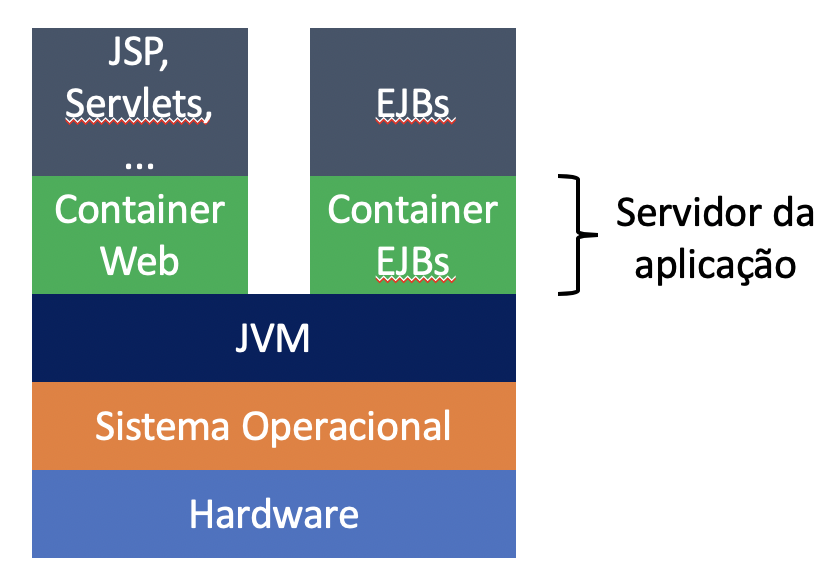
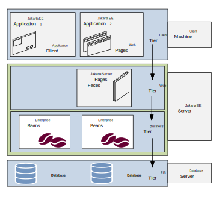

<!-- .slide: data-background-opacity="0.2"data-background-image="https://dailytravelpill.com/wp-content/uploads/2021/02/backpacking-in-java-attractions.jpg" 
data-transition="zoom" 
-->
# Introdução aos EJBs
<!-- .element: style="margin-bottom:100px; font-size: 50px; color:#f5f5f5; font-family: Marker Felt; " -->

Pressione 'F' para tela cheia
<!-- .element: style="margin-bottom:10px; font-size: 15px; color:white;" -->

[versão em pdf](?print-pdf)
<!-- .element: style="margin-bottom:30px; font-size: 15px;" -->

<!-- .slide: data-background="#222c44" data-transition="zoom" -->
## O que são os Enterprise Java Beans?
<!-- .element: style="margin-bottom:60px; font-size: 50px; color:white; font-family: Marker Felt;" -->

* Um Enterprise Java Bean (EJB) é um **componente** que roda no lado do servidor que encapsula as regras de negócio de uma aplicação
<!-- .element: style="margin-bottom:70px; font-size: 25px; color:white; font-family: arial;" -->

* A lógica do negócio é o código que cumpre o propósito da aplicação
<!-- .element: style="margin-bottom:70px; font-size: 25px;color:white; font-family: arial;" -->

* Por exemplo, em um aplicativo de controle de estoque, os enterprise beans podem implementar a lógica de métodos como: *checkInventoryLevel* ou *orderProduct*
<!-- .element: style="margin-bottom:70px; font-size: 25px;color:white; font-family: arial;" -->

<!-- .slide: data-background="#222c44" data-transition="zoom" -->
## O que são os Enterprise Java Beans?
<!-- .element: style="margin-bottom:60px; font-size: 50px; color:white; font-family: Marker Felt;" -->

* A imagem apresenta, de forma geral, as camadas de software necessárias para executar os EJBs
<!-- .element: style="margin-bottom:10px; font-size: 25px;color:white; font-family: arial;" -->

 <!-- .element height="50%" width="50%" -->

<!-- .slide: data-background="#222c44" data-transition="zoom" -->
## Camadas do Jakarta EE
<!-- .element: style="margin-bottom:60px; font-size: 50px; color:white; font-family: Marker Felt;" -->

 <!-- .element height="50%" width="50%" -->

Fonte: [The Jakarta® EE Tutorial](https://eclipse-ee4j.github.io/jakartaee-tutorial/)
<!-- .element: style="margin-bottom:50px; font-size: 15px;" -->

<!-- .slide: data-background="#222c44" data-transition="zoom" -->
## Benefícios de um Enterprise Bean
<!-- .element: style="margin-bottom:50px; font-size: 50px; color:white; font-family: Marker Felt;" -->

* Enterprise beans simplificam o desenvolvimento de aplicações grandes e distribuídas
<!-- .element: style="margin-bottom:60px; font-size: 25px;color:white; font-family: arial;" -->

* Primeiro, o container EJB provê serviços como: gerenciamento de transações e autorização de segurança
<!-- .element: style="margin-bottom:60px; font-size: 25px;color:white; font-family: arial;" -->

* Segundo, como os beans encapsulam a lógica do negócio, os clientes não irão possuir código como regras de negócio ou acesso aos bancos de dados
<!-- .element: style="margin-bottom:60px; font-size: 25px;color:white; font-family: arial;" -->

* Terceiro, novas aplicações podem ser criadas a partir dos beans que possuem as regras de negócio existentes
<!-- .element: style="margin-bottom:60px; font-size: 25px;color:white; font-family: arial;" -->

<!-- .slide: data-background="#222c44" data-transition="zoom" -->
## Quando utilizar um EJB?
<!-- .element: style="margin-bottom:60px; font-size: 50px; color:white; font-family: Marker Felt;" -->

* A aplicação necessitar ser escalável
<!-- .element: style="margin-bottom:30px; font-size: 30px; color:white; font-family: arial;" -->

  * Para acomodar um número crescente de usuários, você pode necessitar distribuir os componentes de uma aplicação em várias máquinas
  <!-- .element: style="margin-bottom:50px; font-size: 20px; color:white; font-family: arial;" -->

* As operações devem garantir a integridade dos dados
<!-- .element: style="margin-bottom:30px; font-size: 30px; color:white; font-family: arial;" -->

  * Enterprise beans suportam transações e controlam o acesso simultâneo a objetos compartilhados
  <!-- .element: style="margin-bottom:50px; font-size: 20px; color:white; font-family: arial;" -->

* A aplicação terá uma variedade de clientes
<!-- .element: style="margin-bottom:30px; font-size: 30px; color:white; font-family: arial;" -->

  * Clientes remotos podem facilmente localizar um EJB. Esses clientes podem ser finos, variados e numerosos
  <!-- .element: style="margin-bottom:50px; font-size: 20px; color:white; font-family: arial;" -->

<!-- .slide: data-background="#222c44" data-transition="zoom" -->
## Tipos de Enterprise Beans
<!-- .element: style="margin-bottom:60px; font-size: 50px; color:white; font-family: Marker Felt;" -->

* Session
<!-- .element: style="margin-bottom:30px; font-size: 30px; color:white; font-family: arial;" -->
  * Executam tarefas para um cliente, opcionalmente, pode implementar um Web Service
  <!-- .element: style="margin-bottom:30px; font-size: 25px; color:white; font-family: arial;" -->
  * Os Session podem ser: Stateless, Stateful e Singleton
  <!-- .element: style="margin-bottom:30px; font-size: 25px; color:white; font-family: arial;" -->

* Message-driven
<!-- .element: style="margin-bottom:30px; font-size: 30px; color:white; font-family: arial;" -->
  * Atuam como um listener para um tipo de mensagem específica, como por exemplo, mensagens JMS (Java Message Service)
<!-- .element: style="margin-bottom:50px; font-size: 25px; color:white; font-family: arial;" -->

<!-- .slide: data-background="#222c44" data-transition="convex" -->
## Referência
<!-- .element: style="margin-bottom:50px; font-size: 50px; color:white; font-family: Marker Felt;" -->

[The Jakarta® EE Tutorial](https://eclipse-ee4j.github.io/jakartaee-tutorial/)
<!-- .element: style="margin-bottom:70px; font-size: 30px;" -->

 
<a rel="license" href="http://creativecommons.org/licenses/by/4.0/">Creative Commons Atribuição 4.0 Internacional</a>

