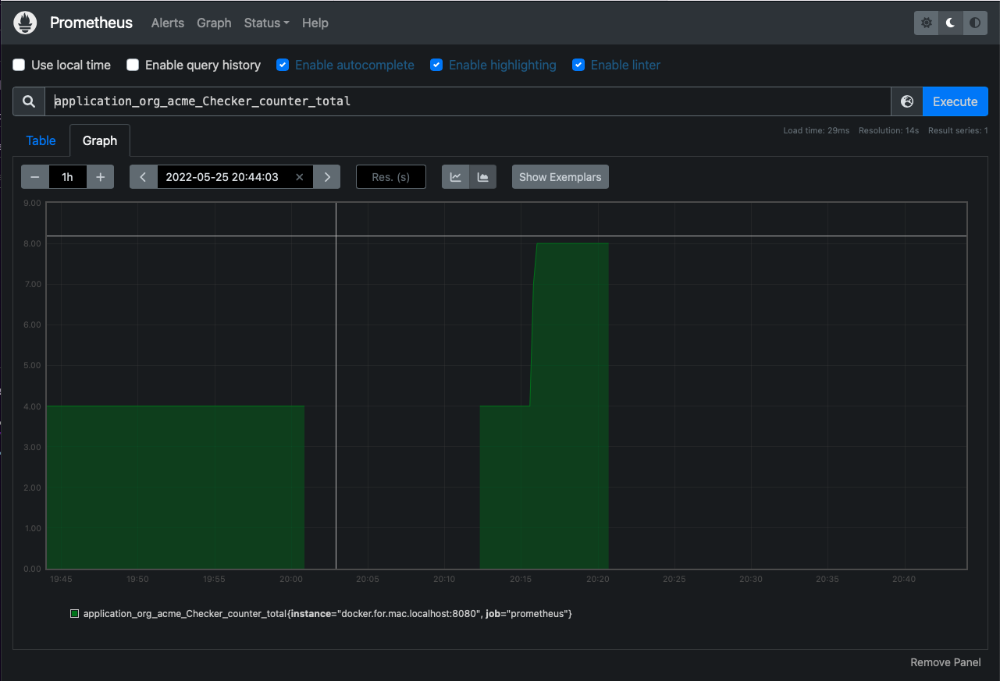

<!-- .slide: data-background-opacity="0.3" data-background-image="https://pw2.rpmhub.dev/topicos/metrics/slides/img/title.jpg" data-transition="convex" -->
# Metrics 📏
<!-- .element: style="margin-bottom:100px; font-size: 60px; color:white; font-family: Marker Felt;" -->

Pressione 'F' para tela cheia
<!-- .element: style="margin-bottom:10px; font-size: 15px; color:white" -->

[versão em pdf](?print-pdf)
<!-- .element: style="margin-bottom 25px; font-size: 15px; color:white" -->


<!-- .slide: data-background="#21093D" data-transition="convex" -->
## Micrometer 📏
<!-- .element: style="margin-bottom:50px; font-size: 50px; color:white; font-family: Marker Felt;" -->

* O [Micrometer](https://micrometer.io) é a abordagem **recomendada** pelo Quarkus para coleta de métricas
<!-- .element: style="margin-bottom:50px; font-size: 25px; color:white" -->

* Fornece uma camada de abstração para diferentes sistemas de monitoramento: Prometheus, Datadog, InfluxDB, etc.
<!-- .element: style="margin-bottom:50px; font-size: 25px; color:white" -->

* Define uma API comum para tipos básicos de medidores: **Counter**, **Gauge**, **Timer** e **DistributionSummary**
<!-- .element: style="margin-bottom:50px; font-size: 25px; color:white" -->


<!-- .slide: data-background="#21093D" data-transition="convex" -->
## Micrometer no Quarkus
<!-- .element: style="margin-bottom:50px; font-size: 50px; color:white; font-family: Marker Felt;" -->

* Adicione a extensão `quarkus-micrometer-registry-prometheus` ao projeto:
<!-- .element: style="margin-bottom:30px; font-size: 25px; color:white" -->

```bash
./mvnw quarkus:add-extension -Dextensions='micrometer-registry-prometheus'
```
<!-- .element: style="margin-bottom:40px; font-size: 18px; font-family: arial; color:black; background-color: #F2FAF3;" -->

* Ou adicione no `pom.xml`:
<!-- .element: style="margin-bottom:30px; font-size: 25px; color:white" -->

```xml
<dependency>
    <groupId>io.quarkus</groupId>
    <artifactId>quarkus-micrometer-registry-prometheus</artifactId>
</dependency>
```
<!-- .element: style="margin-bottom:40px; font-size: 18px; font-family: arial; color:black; background-color: #F2FAF3;" -->

* O endpoint `/q/metrics` passa a estar disponível no formato **OpenMetrics/Prometheus**
<!-- .element: style="margin-bottom:30px; font-size: 25px; color:white" -->


<!-- .slide: data-background="#21093D" data-transition="convex" -->
## Alguns exemplos do que pode ser monitorado
<!-- .element: style="margin-bottom:100px; font-size: 50px; color:white; font-family: Marker Felt;" -->

* Tempo de CPU
<!-- .element: style="margin-bottom:50px; font-size: 27px; color:white" -->

* Memória ocupada (heap e direct memory)
<!-- .element: style="margin-bottom:50px; font-size: 27px; color:white" -->

* Desempenho de endpoints HTTP
<!-- .element: style="margin-bottom:50px; font-size: 27px; color:white" -->

* Métricas de negócios (ex.: número de pagamentos por segundo)
<!-- .element: style="margin-bottom:50px; font-size: 27px; color:white" -->

* Recursos de pools (banco de dados, cache, Redis...)
<!-- .element: style="margin-bottom:50px; font-size: 27px; color:white" -->


<!-- .slide: data-background="#21093D" data-transition="convex" -->
## Tags Dimensionais
<!-- .element: style="margin-bottom:50px; font-size: 50px; color:white; font-family: Marker Felt;" -->

* No Micrometer **não existem** mais prefixos `base`, `vendor` e `application`
<!-- .element: style="margin-bottom:50px; font-size: 25px; color:white" -->

* As métricas usam **tags** (pares chave/valor) para enriquecer e filtrar dados
<!-- .element: style="margin-bottom:50px; font-size: 25px; color:white" -->

* Os nomes usam pontos como separador e são convertidos para underscore no Prometheus:
<!-- .element: style="margin-bottom:30px; font-size: 25px; color:white" -->

  * `http.server.requests` → `http_server_requests_duration_seconds`
  <!-- .element: style="margin-bottom:30px; font-size: 23px; color:#b0e0ff" -->

  * `example.prime.number` → `example_prime_number_total`
  <!-- .element: style="margin-bottom:30px; font-size: 23px; color:#b0e0ff" -->


<!-- .slide: data-background="#21093D" data-transition="convex" -->
## Obtendo o MeterRegistry
<!-- .element: style="margin-bottom:50px; font-size: 50px; color:white; font-family: Marker Felt;" -->

```java
// 1. Injeção via construtor (recomendada)
@Path("/example")
public class ExampleResource {
    private final MeterRegistry registry;

    ExampleResource(MeterRegistry registry) {
        this.registry = registry;
    }
}
```
<!-- .element: style="margin-bottom:40px; font-size: 18px; font-family: arial; color:black; background-color: #F2FAF3;" -->

```java
// 2. Injeção via campo
@Inject
MeterRegistry registry;
```
<!-- .element: style="margin-bottom:40px; font-size: 18px; font-family: arial; color:black; background-color: #F2FAF3;" -->


<!-- .slide: data-background="#21093D" data-transition="convex" -->
## Exemplo Completo
<!-- .element: style="margin-bottom:30px; font-size: 50px; color:white; font-family: Marker Felt;" -->

```java
@Path("/example")
public class PrimeResource {
    private final MeterRegistry registry;
    private final Counter primeCounter;
    private final AtomicLong highestPrime = new AtomicLong(0);

    PrimeResource(MeterRegistry registry) {
        this.registry = registry;
        this.primeCounter = registry.counter("example.prime.number", "type", "prime");
        Gauge.builder("example.prime.highest", highestPrime, AtomicLong::get)
                .description("The highest prime number found so far")
                .register(registry);
    }

    @GET
    @Path("/prime/{number}")
    @Timed(value = "example.prime.check", description = "Time spent checking primes")
    public String checkIfPrime(@PathParam("number") long number) {
        if (testPrime(number)) {
            primeCounter.increment();
            if (number > highestPrime.get()) highestPrime.set(number);
            return number + ": prime";
        }
        return number + ": not prime";
    }
}
```
<!-- .element: style="margin-bottom:30px; font-size: 15px; font-family: arial; color:black; background-color: #F2FAF3;" -->


<!-- .slide: data-background="#21093D" data-transition="convex" -->
## Tipos de Métricas 🖼️
<!-- .element: style="margin-bottom:50px; font-size: 50px; color:white; font-family: Marker Felt;" -->

* **Counter** — valores que só aumentam (requisições, erros, eventos)
<!-- .element: style="margin-bottom:40px; font-size: 25px; color:white" -->

* **Gauge** — valores que sobem e descem (tamanho de fila, memória livre)
<!-- .element: style="margin-bottom:40px; font-size: 25px; color:white" -->

* **Timer** — latências e frequência de ocorrência (tempo de resposta HTTP)
<!-- .element: style="margin-bottom:40px; font-size: 25px; color:white" -->

* **DistributionSummary** — valores arbitrários (bytes transferidos, valor de transações)
<!-- .element: style="margin-bottom:40px; font-size: 25px; color:white" -->


<!-- .slide: data-background="#21093D" data-transition="convex" -->
## Counter
<!-- .element: style="margin-bottom:50px; font-size: 50px; color:white; font-family: Marker Felt;" -->

```java
// Via MeterRegistry
registry.counter("payments.processed", "method", "credit_card").increment();
```
<!-- .element: style="margin-bottom:30px; font-size: 18px; font-family: arial; color:black; background-color: #F2FAF3;" -->

```java
// Via builder
Counter.builder("orders.created")
    .description("Total orders created")
    .tags("channel", "web")
    .register(registry)
    .increment();
```
<!-- .element: style="margin-bottom:30px; font-size: 18px; font-family: arial; color:black; background-color: #F2FAF3;" -->

```java
// Via anotação
@Counted(value = "orders.created", extraTags = {"source", "api"})
public Order createOrder(OrderRequest request) { ... }
```
<!-- .element: style="margin-bottom:30px; font-size: 18px; font-family: arial; color:black; background-color: #F2FAF3;" -->


<!-- .slide: data-background="#21093D" data-transition="convex" -->
## Gauge
<!-- .element: style="margin-bottom:50px; font-size: 50px; color:white; font-family: Marker Felt;" -->

```java
// Monitorar o tamanho de uma coleção
List<String> pendingJobs = registry.gaugeCollectionSize(
    "jobs.pending",
    Tags.of("type", "import"),
    new ArrayList<>()
);
```
<!-- .element: style="margin-bottom:30px; font-size: 18px; font-family: arial; color:black; background-color: #F2FAF3;" -->

```java
// Via builder com função
Gauge.builder("cache.size", cache, Cache::size)
    .description("Current cache size")
    .register(registry);
```
<!-- .element: style="margin-bottom:30px; font-size: 18px; font-family: arial; color:black; background-color: #F2FAF3;" -->

* Use Gauge somente quando não for possível usar Counter — se o valor só incrementa, prefira Counter
<!-- .element: style="margin-bottom:30px; font-size: 22px; color:#ffdd99" -->


<!-- .slide: data-background="#21093D" data-transition="convex" -->
## Timer
<!-- .element: style="margin-bottom:50px; font-size: 50px; color:white; font-family: Marker Felt;" -->

```java
// Via anotação (forma mais simples)
@Timed(value = "payment.processing", extraTags = {"gateway", "stripe"})
public PaymentResult processPayment(Payment payment) { ... }
```
<!-- .element: style="margin-bottom:30px; font-size: 18px; font-family: arial; color:black; background-color: #F2FAF3;" -->

```java
// Via builder
Timer.builder("db.query")
    .description("Database query duration")
    .tags("table", "orders")
    .register(registry)
    .record(() -> executeQuery());
```
<!-- .element: style="margin-bottom:30px; font-size: 18px; font-family: arial; color:black; background-color: #F2FAF3;" -->

```java
// Via Sample (paths complexos)
Timer.Sample sample = Timer.start(registry);
// ... lógica ...
sample.stop(registry.timer("checkout.flow", "step", "payment"));
```
<!-- .element: style="margin-bottom:30px; font-size: 18px; font-family: arial; color:black; background-color: #F2FAF3;" -->


<!-- .slide: data-background="#21093D" data-transition="convex" -->
## Métricas Automáticas 🤖
<!-- .element: style="margin-bottom:50px; font-size: 50px; color:white; font-family: Marker Felt;" -->

* O Micrometer instrui automaticamente diversas partes do Quarkus **sem configuração adicional**
<!-- .element: style="margin-bottom:40px; font-size: 25px; color:white" -->

* **HTTP server**: `http_server_requests_seconds_count/sum/max` com tags `uri`, `method`, `status`
<!-- .element: style="margin-bottom:40px; font-size: 23px; color:white" -->

* **JVM**: memória heap/non-heap, threads, garbage collection
<!-- .element: style="margin-bottom:40px; font-size: 23px; color:white" -->

* **Netty**: `allocator_memory_used` (heap e direct), `allocator_memory_pinned`
<!-- .element: style="margin-bottom:40px; font-size: 23px; color:white" -->

* Extensões: `quarkus-hibernate-orm`, `quarkus-agroal`, `quarkus-redis-client`, `quarkus-cache`, `quarkus-grpc`, Kafka, RabbitMQ...
<!-- .element: style="margin-bottom:40px; font-size: 23px; color:white" -->


<!-- .slide: data-background="#21093D" data-transition="convex" -->
## Prometheus
<!-- .element: style="margin-bottom:50px; font-size: 50px; color:white; font-family: Marker Felt;" -->

O [Prometheus](https://prometheus.io) é um aplicativo de software gratuito usado para monitoramento e alerta de eventos.
<!-- .element: style="margin-bottom:50px; font-size: 25px; color:white" -->

<br/>


<!-- .slide: data-background="#21093D" data-transition="convex" -->
## docker-compose.yml
<!-- .element: style="margin-bottom:50px; font-size: 50px; color:white; font-family: Marker Felt;" -->

```yml
volumes:
    metrics:
services:
    prometheus:
      image: prom/prometheus:v3.11.3
      container_name: prometheus
      ports:
        - 9090:9090
      volumes:
        - metrics:/etc/prometheus
        - ./prometheus.yml:/etc/prometheus/prometheus.yml
      extra_hosts:
        - "host.docker.internal:host-gateway"
```
<!-- .element: style="margin-bottom:30px; font-size: 18px; font-family: arial; color:black; background-color: #F2FAF3;" -->

* `extra_hosts` garante que `host.docker.internal` funcione no **Linux** (Mac/Windows já resolvem nativamente)
<!-- .element: style="margin-bottom:30px; font-size: 22px; color:white" -->


<!-- .slide: data-background="#21093D" data-transition="convex" -->
## prometheus.yml
<!-- .element: style="margin-bottom:50px; font-size: 50px; color:white; font-family: Marker Felt;" -->

```yml
global:
  scrape_interval: 15s
  evaluation_interval: 15s
scrape_configs:
  - job_name: "quarkus-app"
    metrics_path: "/q/metrics"
    # host.docker.internal: Mac e Windows resolvem nativamente
    # Linux: adicione extra_hosts no docker-compose.yml
    static_configs:
      - targets: ["host.docker.internal:8080"]
      # Linux sem extra_hosts: use 172.17.0.1:8080
```
<!-- .element: style="margin-bottom:30px; font-size: 18px; font-family: arial; color:black; background-color: #F2FAF3;" -->

* O Prometheus coleta métricas periodicamente via o endpoint `/q/metrics`
<!-- .element: style="margin-bottom:30px; font-size: 22px; color:white" -->


<!-- .slide: data-background="#21093D" data-transition="convex" -->
## Referências 📚
<!-- .element: style="margin-bottom:50px; font-size: 50px; color:white; font-family: Marker Felt;" -->

* Alex Soto Bueno; Jason Porter; [Quarkus Cookbook: Kubernetes-Optimized Java Solutions.](https://www.amazon.com.br/gp/product/B08D364VMD/ref=as_li_tl?ie=UTF8&camp=1789&creative=9325&creativeASIN=B08D364VMD&linkCode=as2&tag=rpmhub-20&linkId=2f82a4bb959a1797ec9791e0af68d1af) Editora: O'Reilly Media, 2020.
<!-- .element: style="margin-bottom:40px; font-size: 25px; color:white" -->

* Micrometer Metrics. Disponível em: [https://quarkus.io/guides/telemetry-micrometer](https://quarkus.io/guides/telemetry-micrometer)
<!-- .element: style="margin-bottom:40px; font-size: 25px; color:white" -->

* Micrometer Documentation. Disponível em: [https://micrometer.io/docs](https://micrometer.io/docs)
<!-- .element: style="margin-bottom:40px; font-size: 25px; color:white" -->

<center>
<a href="https://rpmhub.dev" target="blanck"></a><br/>
<a rel="license" href="http://creativecommons.org/licenses/by/4.0/">CC BY 4.0 DEED</a>
</center>
