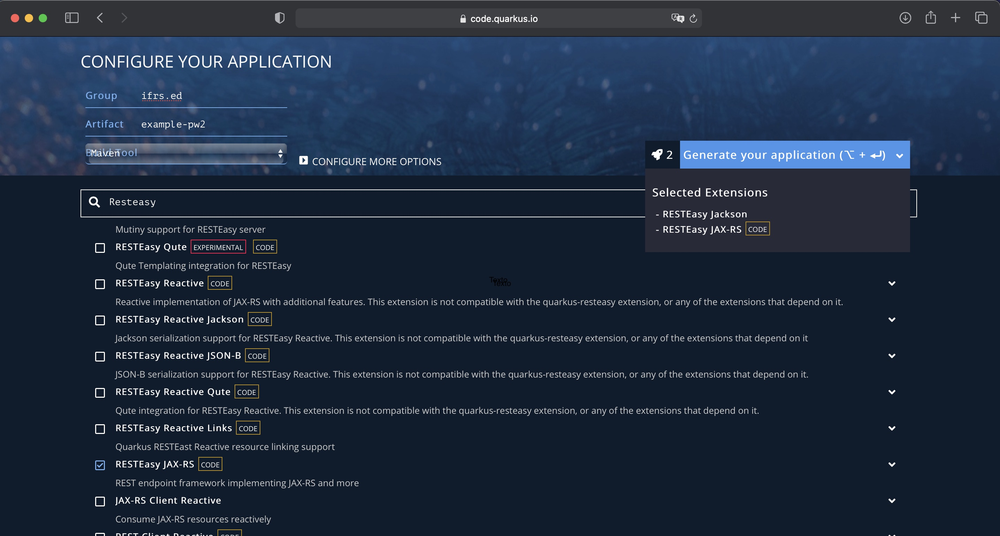

# Instalação do Quarkus

Essa página tem como o objetivo de orientar sobre a instalação do Quarkus.

## Configurando o ambiente

Antes de utilizar o Quarkus você necessita instalar o Java e o Maven na sua máquina. Caso você esteja com essas duas ferramentas instaladas, por favor, pule as próximas duas subseções.

### Java ♨️

Antes de iniciarmos, se faz necessário verificar se você possui uma JVM (*Java Virtual Maquine*) e um JDK (*Java Development Kit*) 11 ou superior instalado na sua máquina:

    java -version

Se o comando retornar algo parecido com a saída abaixo, significa que você possui uma JVM:

```
java version "13.0.2" 2020-01-14
Java(TM) SE Runtime Environment (build 13.0.2+8)
Java HotSpot(TM) 64-Bit Server VM (build 13.0.2+8, mixed mode, sharing)
```

Para verificar se o JDK que está instalado digite:

    javac -version

Se o comando acima retornar algo parecido com o texto abaixo, significa que você possui um JDK instalado:

```
javac 11.0.11
```

Porém, se você não tiver nada de Java instalado na sua máquina, abra um terminal e com permissões de administrador digite os seguintes comandos:

* Linux Ubuntu/Debian: `sudo apt install default-jdk`
* Windows por meio do [Chocolatey](https://chocolatey.org): `choco install openjdk --version=11.0`
* macOS por meio do [Homebrew](https://brew.sh/index_pt-br): `brew install openjdk@11`

🚨 **Nota:** os exemplos no Chocolatey e Homebrew mostram como instalar o [OpenJDK](https://openjdk.java.net) na versão 11.

### Maven 🌐

Os exemplos da disciplina serão apresentados com o [Maven](https://maven.apache.org). Para instalar o Maven utilizando um gerenciados de pacotes, abra um terminal e com permissão de administrador digite:

* Linux Ubuntu/Debian: `apt-get install maven`
* Windows por meio do [Chocolatey](https://chocolatey.org): `choco install maven`
* macOS por meio do [Homebrew](https://brew.sh/index_pt-br): `brew install maven`

 🚨 **Para saber mais:** Para se obter mais informações sobre como instalar o Maven, por favor, consulte a [documentação](https://maven.apache.org/install.html) de instalação do Maven. Além disso, se você deseja saber mais informações, o artigo ["Configurando Variáveis de Ambiente JAVA_HOME e MAVEN_HOME no Windows e Unix"](https://medium.com/beelabacademy/configurando-variáveis-de-ambiente-java-home-e-maven-home-no-windows-e-unix-d9461f783c26) aprofunda o assuno uma vez que mostra detalhes da instalação do Java e do Maven.

## Quarkus IO

A forma mais fácil de iniciar um projeto com o Quarkus é acessar o site [https://code.quarkus.io](https://code.quarkus.io) que disponibiliza uma ferramenta para configurar e baixar um projeto Quarkus inicial.

Nesse site você pode escolher se quer que o seu projeto tenha as suas dependências e ciclo de *build* gerenciado por meio do [Maven](https://maven.apache.org) ou [Gradle](https://gradle.org). Também é possível escolher as dependências necessárias para o projeto, como por exemplo, [RESTEasy JAX-RS](https://quarkus.io/guides/rest-json), [Hibernate com o Panache](https://quarkus.io/guides/hibernate-orm-panache), [Smallrye JWT](https://quarkus.io/guides/security-jwt) entre muitas outras. Caso você necessite de novas dependências para o seu projeto não se preocupe, pois, existem pelo menos mais duas formas de adicionar essas dependências (VSCode, Quarkus CLI, etc.) no tempo de desenvolvimento do sistema.

<center>
    
    <br>
    Fig 1 - Site Quarkus.io
</center>

Depois de configurar, o site irá permitir que você faça um *download* do projeto no formato `.zip`. Para executar o projeto, basta descompactar e, na raiz do projeto (localização do arquivo pom.xml) executar o comando do Maven:

    mvn compile quarkus:dev

## Quarkus CLI ⚙️

Outra forma interessante de se trabalhar com o Quarkus é por meio de sua interface de linha de comando (_Command Line Interface_ - [CLI](https://quarkus.io/guides/cli-tooling)). Para instalar o CLI inicialmente temos que instalar o [jbang](https://www.jbang.dev/download/) por meio do seguinte comando no Linux, macOS, Windows (WSL/Bash):

    curl -Ls https://sh.jbang.dev | bash -s - app install --fresh --force quarkus@quarkusio

Depois de instalar o jbang instale o CLI:

    jbang app install --fresh --force quarkus@quarkusio
    jbang app install --force --name qss ~/.m2/repository/io/quarkus/quarkus-cli/999-SNAPSHOT/quarkus-cli-999-SNAPSHOT-runner.jar

Faça um teste para ver se tudo foi instalado corretamente:

    quarkus --version

Se você digitar `quarkus --help` será possível verificar todas as [funcionalidades do CLI](https://quarkus.io/guides/cli-tooling#using-the-cli), entre elas: criar um projeto (app ou linha de comando), fazer um *build*, rodar um projeto em modo de desenvolvimento, entre outros.

## Quarkus no VSCode 🖥️

Outra forma ótima de se utilizar o Quarkus é por meio de uma [extensão](https://marketplace.visualstudio.com/items?itemName=redhat.vscode-quarkus) do VSCode. Essa extensão permite, por exemplo, que você crie um projeto Quarkus, adicione extensões ao seu projeto, depure um projeto, faça um build de um projeto, etc.


