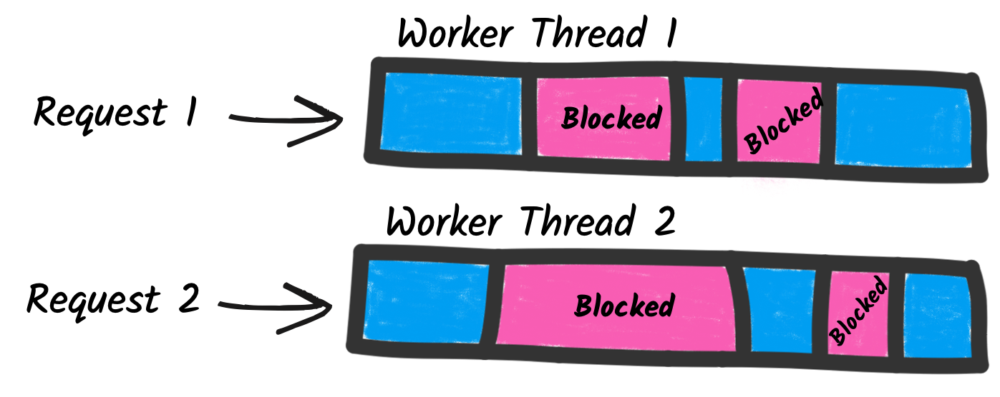
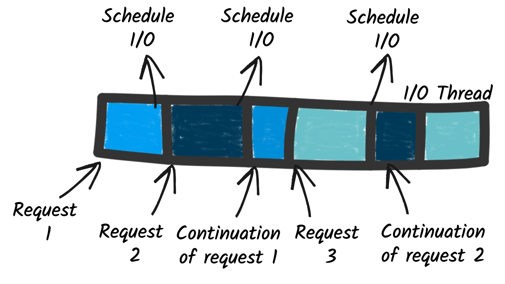

## Programação Reativa

No Quarkus, a programação reativa é um jeito alternativo de desenvolver
aplicações: em vez de trabalhar com chamadas que bloqueiam até terminar, ela se
baseia em processamento assíncrono, não bloqueante e orientado a eventos.
{: .fs-3 }

Em um modelo tradicional (baseado em servlets), cada requisição ocupa uma thread
até que tudo seja concluído. Isso limita a escalabilidade, porque o servidor
precisa de muitas threads e memória para lidar com várias conexões ao mesmo
tempo.
{: .fs-3 }



O Quarkus adota um modelo reativo usando o Vert.x como motor. Esse motor
funciona com loops de eventos (event loops), que processam as requisições sem
criar uma thread para cada conexão.
{: .fs-3 }



Em vez de devolver imediatamente o resultado, os métodos retornam tipos reativos,
como:
{: .fs-3 }

* Uni<T> → representa um único resultado futuro.
* Multi<T> → representa um fluxo (stream) de vários elementos ao longo do tempo.
{: .fs-3 }

Como não há bloqueio de threads, é possível atender milhares de conexões
simultâneas consumindo menos memória e CPU. Isso torna as aplicações mais leves
rápidas e escaláveis.
{: .fs-3 }

## Vert.x

O Quarkus é construído sobre o Eclipse Vert.x, que fornece um ***event loop***
(Event Pool) baseado em epoll (no Linux) ou kqueue (em BSD/macOS). Cada event
loop thread é capaz de gerenciar milhares de conexões concorrentes sem a
necessidade de criar uma thread para cada cliente.
{: .fs-3 }

Uma boa analogia é imaginar uma telefonista: ela não conversa com todos os
clientes ao mesmo tempo, mas atende a ligação, anota a solicitação e encaminha
para o destino correto. Assim, pode lidar com um grande volume de chamadas de
forma organizada e contínua.
{: .fs-3 }

No Linux, o event loop utiliza a primitiva epoll para monitorar milhares de
sockets simultaneamente:
  * Quando algo acontece (por exemplo, a chegada de dados pela rede), o epoll
notifica a thread do event loop.
  * Essa thread, então, aciona o callback correspondente para tratar o evento.

**Nota:** epoll é uma chamada de sistema do kernel Linux que implementa um mecanismo
de notificação de eventos de E/S altamente escalável.


### Principais Métodos

* **onItem:** usado para reagir a eventos bem-sucedidos emitidos por um Uni ou Multi.

* **call:** chama um método assíncrono e espera terminar, um exemplo:

```java
repository.findById(user.id)
    .onItem().ifNotNull()
    .call(item -> {
        item.setName(user.getName());
        item.setEmail(user.getEmail());
        return repository.persistAndFlush(item);
  });
```
{: .fs-3 }

* **invoke:** chama um método assíncrono e retorna imediatamente, atua como um interceptador de um item.

* **transform:** transforma o item emitido por um Uni ou Multi em outro valor.


### Referências

* [Getting Started with Reactive](https://quarkus.io/guides/getting-started-reactive)

* [Mutiny](https://smallrye.io/smallrye-mutiny/2.9.4/)

<center>
<a href="https://rpmhub.dev" target="blanck"></a><br/>
<a rel="license" href="http://creativecommons.org/licenses/by/4.0/">CC BY 4.0 DEED</a>
</center>
